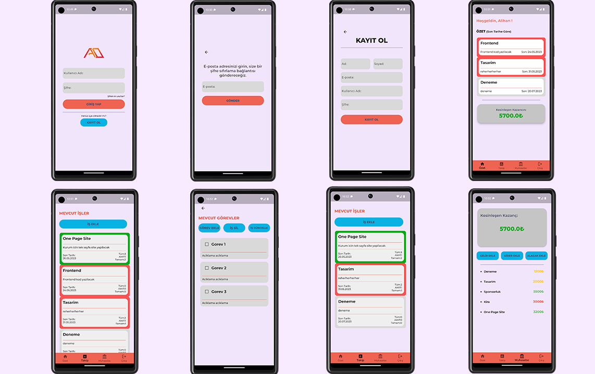

# Bilgisayar Mühendisliği 3.Sınıf Dönem Projesi

<h3>Konu:</h3>

Freelancer Çalışan Yazılımcılar İçin İş Görev ve Basit Muhasebe Takibi Mobil Uygulaması

<h3>Kullanılan Teknolojiler:</h3>

1. Node.js (Express, Mongoose, Bcrypt)
2. Flutter
3. MongoDB
4. Figma

<h3>Nasıl Çalışır:</h3>

Uygulamada veriler MongoDB veritabanı kullanılarak tutulmuş ve tüm uygulama içi aktiviteler Node.js kullanılarak API'lar ile sağlanmıştır. Projenin başında Figma üzerinden tasarlanan arayüz Flutter kullanılarak tasarıma en yakın olacak şekilde koda aktarılmaya çalışılmıştır. Dinamik bir süreç olduğu için tasarım ile kod arasında bir takım değişiklikler mevcuttur.

Figma Tasarım Linki: https://www.figma.com/file/JkW8ZwDa0aOemGpBIrNvVE/Proje---Mobile?type=design&node-id=0%3A1&t=wOxv5zbSoYTfGcZX-1

<h3>Uygulama Fonksiyonları:</h3>

1. Giriş Yap, Kayıt Ol, Şifremi Unuttum
- Kullanıcı kayıt olup giriş yapar ve eğer şifresini unuttuysa mail adresine gelen kodu yine uygulama içerisinde girerek uygulama içerisinde yeni şifresini oluşturabilir. Şifreler veritabanında şifrelenmiş bir şekilde tutulur.

2. İş Ekleme (başlık, kısa açıklama, son tarih, iş durumu(aktif, bekleyen, tamamlanmış), ücret), İş Silme, İş Durumu Güncelleme (Aktif, Bekleyen, Tamamlanmış)
- İş eklendiği zaman iş ücreti, iş durumuna göre otomatik olarak muhasebe kısmına gelir veya alacak şeklinde eklenir.
- Aktif ve bekleyen işlerin ücreti alacak olarak eklenir, tamamlanmış iş ücreti gelir olarak eklenir.
- Sonradan iş durumu güncellendiğinde muhasebe kısmında da bu değişiklik otomatik olarak yapılır.
- İş durumu tamamlanmış ise işin durum güncellemesi yapılamaz. 
- İş silindiği zaman o işe ait tüm görevler ve muhasebe bilgisi de otomatik silinir.
- Son tarihi geçmiş işlerin background rengi kırmızı, tamamlanmış görevlerin background rengi yeşil olur.
- Özet sayfasında tamamlanmış işler gösterilmez, işler son tarihi en yakın olana göre sıralanır.

3. Görev Ekleme (başlık, uzun açıklama), Görev Silme, Görev Tamamlandı Bilgisi Checkbox
- Her işin kendine ait görevleri eklenebilir ve silinebilir.
- İşler tamamlanmış veya tamamlanmamış olarak eklenebilir. Bu bilgi işler ekranında tüm görev, aktif görev, bekleyen görev sayısı şeklinde de gösterilir.

4. Para Bilgisi Ekleme, Silme
- Gelirler yeşil renk, alacaklar sarı renk ve giderler kırmızı renkte gösterilir. Üzerlerine tıklanarak isteilirse silinebilir.
- Kesinleşen kazanç gelirlerden giderlerin çıkarılmasıyla elde edilmiştir. Alacak durumdan gelir durumuna geçen para bilgisi de otomatik olarak kesinleşen kazanca eklenir.
- Sadece bu ekranda eklenen bilgiler silinebilir. Eğer bir iş eklemesiyle eklenen para bilgisi varsa bu, işi silmediğiniz sürece silinemez.

<h3>Uygulama Görselleri</h3>

